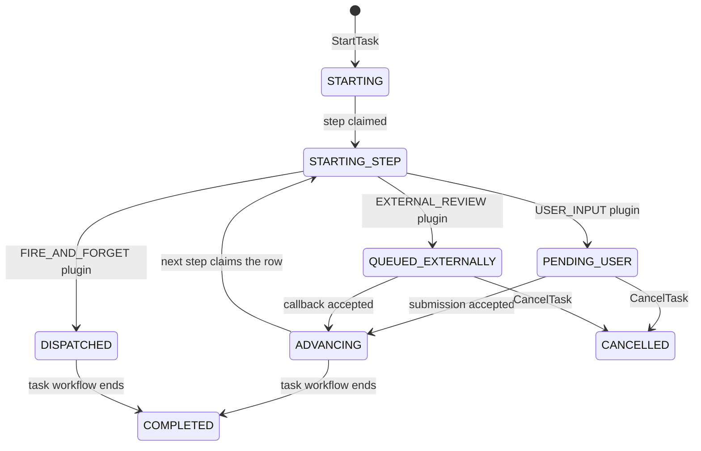
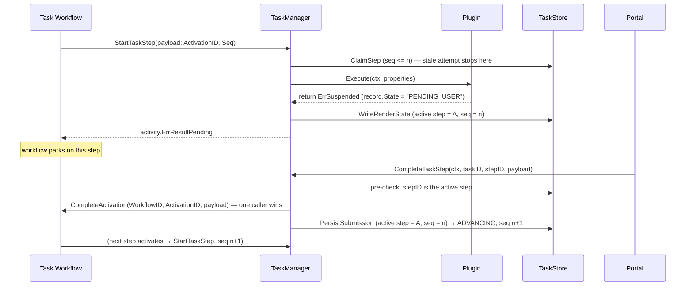

# Architecture

This document is the conceptual reference for the library. Every other guide assumes you've read this one.

## The three layers

The orchestrator separates a long-running business process from the interactive steps that fulfil it, by splitting work across three layers:

| Layer               | Workflow engine instance                | Responsibility                                                                             |
|---------------------|-----------------------------------------|--------------------------------------------------------------------------------------------|
| **Parent Workflow** | Macro workflow on the parent task queue | The end-to-end business journey. Knows nothing about forms, payments, or external systems. |
| **Task**            | Child workflow on the task task queue   | A self-contained micro-flow that fulfils one parent-workflow node.                         |
| **Step**         | A node *inside* a Task workflow         | One interaction step (form, API call, payment) executed by a plugin.                       |

The parent workflow only ever sees TASK nodes. It doesn't know — and doesn't need to know — that a single task is internally a workflow with five steps.

A note on naming: the workflow engine (`workflow/`) only ever sees TASK nodes and calls one run of a node a **TaskActivation** (`TaskPayload.ActivationID`, `Manager.CompleteActivation`) — a domain-neutral term, since the engine is reused at both the Parent Workflow and Task layers above and has no notion of "Task" and "SubTask" as TaskManager understands them. TaskManager is what calls that same run a **Step**. A Step *is* a TaskActivation; it's the same identity, addressed by `ActivationID` on the engine side and by `ActiveStepID` on TaskManager's side, translated at the one boundary where TaskManager calls into the engine.

## Flow diagram

```
[Parent Workflow]                  ← Temporal workflow on parent queue
       │
       │ hits a TASK node
       ▼
parentTaskHandler(payload)
       │
       │ calls TaskManager.StartTask
       ▼
[TaskManager]
       │
       ├──► persists a TaskRecord (state=STARTING)
       │     with parent coordinates: (workflowID, runID, stepID)
       │     and chooses TaskID = payload.ActivationID (the parent's step ID)
       │
       ├──► starts a child Task workflow on the task queue
       │
       └──► returns activity.ErrResultPending
            (parent activity is now suspended)


[Task Workflow]                    ← Temporal workflow on task queue
       │
       │ hits a TASK node
       ▼
taskHandler(payload)
       │
       │ calls TaskManager.StartTaskStep
       ▼
[TaskManager]
       │
       ├──► loads TaskRecord by TaskWorkflowID
       ├──► resolves StepTemplate from registry
       ├──► looks up plugin by TaskType
       ├──► CLAIMS the step in the DB (guarded by seq); a stale attempt stops here
       ├──► plugin.Execute(...)
       │      │
       │      ├─ returns nil          → sync completion, workflow advances
       │      ├─ returns ErrSuspended → ErrResultPending, workflow parks
       │      └─ returns other error  → workflow fails
       └──► writes the render state (guarded by step and seq)

External event (HTTP POST from the portal, webhook, etc.)
       │
       ▼
TaskManager.CompleteTaskStep(ctx, taskID, stepID, payload)
       │
       ├──► pre-checks the row: stepID is the active step
       ├──► runs pre-resume extensions (authz, validation)
       ├──► calls TemporalManager.CompleteActivation(stepID, ...)   ← the arbiter: one caller wins
       │       │
       │       ▼
       │    [Task Workflow] resumes the parked step and advances
       └──► persists the submission (state ADVANCING), guarded by step and seq


[Task Workflow] reaches END
       │
       ▼
taskCompletionHandler(WorkflowCompletion)
       │
       │ calls TaskManager.HandleTaskCompletion
       ▼
[TaskManager]
       │
       ├──► marks TaskRecord state=COMPLETED, guarded by seq
       └──► then invokes onTaskCompleted callback
              │
              ▼
       [Parent Workflow] resumes the parked TASK node
```

## Steps: one run of a node

A node ID in a workflow definition names the *definition*. A node that a loop visits twice is two *runs*, and something addressed to the first run must not be applied to the second. So every run of a TASK node is a **step**:

- The workflow keeps a counter, `seq`, that goes up by one each time any node starts a run (START, GATEWAY, TIMER and END too, not just TASK). It never repeats or goes backwards, but one TASK node's `seq` is not necessarily the previous TASK node's plus one, so compare `seq` values only for order.
- The step ID is a UUIDv5 of `(workflow ID, node ID, seq)`. It is a pure function of those, so it is the same on every replay, and it is the ID of the Temporal Activity.
- `TaskPayload` carries `NodeID` (the definition), `ActivationID` and `Seq`.

Completing a step is `CompleteActivation(workflowID, activationID, …)`. Temporal completes an Activity exactly once, so of any number of racing or repeated calls one wins, and a call for a step that is no longer pending (an earlier pass of a loop, an already-completed step) fails with `engine.ErrActivationNotPending` and changes nothing. That is the authority on whether a step is active; the database is only ever a read model of it.

## The `TaskRecord`: one row, the render state

A single `store.TaskRecord` holds what is needed to render a task, plus the coordinates of its parent:

```go
type TaskRecord struct {
    // 1. Identity
    TaskID       string          // = the parent's step ID (a UUID); how external callers address this task
    TaskType     string          // user-facing category from the TaskTemplate (e.g. "APPLICATION")
    State        string          // current lifecycle state (drives rendering)
    RenderConfig json.RawMessage // snapshotted render config for this task

    // 2. Parent coordinates — used to wake the parent workflow on completion. No ParentRunID: the
    // parent workflow never has more than one run, so "" always addresses the current one.
    ParentWorkflowID string
    ParentStepID     string // the parent's step ID: the Activity to complete

    // 3. The active step
    TaskWorkflowID       string
    ActiveStepID         string // the run of the step node that is active
    Seq                  int64  // the row's version: the workflow's step counter
    ActiveTaskTemplateID string

    // 4. Render data — the active step's inputs plus what it and the caller added
    Data map[string]any

    CreatedAt, UpdatedAt time.Time
}
```

`Data` is the current step's data, not an accumulation: each step's claim sets it from that step's mapped inputs. What an earlier step submitted reaches the next one through the workflow's variables and the node's `input_mapping`.

### Guarded writes

`ActiveStepID` and `Seq` are written only by five conditional statements on `TaskStore`. Each is one atomic write whose guard is part of the statement, and each returns the rows it changed; **0 rows means the write was stale and was dropped, which is not an error.**

| Method               | Called by             | Guard                                   | Sets                                               |
|----------------------|-----------------------|-----------------------------------------|----------------------------------------------------|
| `ClaimStep`          | `StartTaskStep`        | stored `seq <= n`                       | active step, `seq = n`, template, `STARTING_STEP`, data from inputs |
| `WriteRenderState`   | `StartTaskStep`        | active step is `A` and `seq = n`        | state and data the plugin produced                 |
| `PersistSubmission`  | `CompleteTaskStep`    | active step is `A` and `seq = n`        | data, `ADVANCING`, `seq = n+1`                     |
| `CompleteTask`       | `HandleTaskCompletion`| stored `seq <= m`                       | `COMPLETED`, `seq = m`                             |
| `CancelTask`         | `CancelTask`          | state is not `COMPLETED`                | `CANCELLED`, `seq = seq+1`                         |

`InitTask` still exists for creating the row and for coarse fields, but it never writes `ActiveStepID` or `Seq`, so a stale full-record save cannot move them.

The guards are what make every ordering of these calls safe: a late or retried start of step A cannot run after B has claimed the row (its claim matches nothing, so its plugin does not run and no outbound call is made); a callback that arrives before A's render write wins, and the render write is then dropped; the persist for A cannot land over B's claim; and a repeated call for the same step matches again, so retries are safe.

Two sets of coordinates, never both active at once:

- **Parent coordinates** are written once at `StartTask` and consumed once at `HandleTaskCompletion`.
- **The active step** is overwritten every time a new step claims the row, and is what `CompleteTaskStep` checks against.

## Lifecycle and states

`TaskRecord.State` is plain string for flexibility — it's set by plugins and read by the renderer. The orchestrator itself writes these values:

- `STARTING` — set by `StartTask` before the task workflow runs its first step.
- `STARTING_STEP` — set by the claim, while a step's plugin has not yet reported the state to render.
- `ADVANCING` — set when a submission was accepted by the workflow and it is moving to the next node. It offers no actions, since a second submission could only be rejected as stale.
- `COMPLETED` — set by `HandleTaskCompletion` when the task workflow ends.
- `CANCELLED` — set by `TaskManager.CancelTask`, which closes a task from outside its workflow and terminates that workflow. Advancing `seq` drops any step write still in flight, and a submission is rejected as stale. The parent's TASK node is left waiting; the caller decides what happens to it, typically parking it with `ForceParkActivation` so an admin can resolve it.

Everything else is a plugin's responsibility:

| Plugin (built-in)                 | State set                                | Behaviour                                            |
|-----------------------------------|------------------------------------------|------------------------------------------------------|
| `UserInputPlugin`                 | `PENDING_USER` (or `cfg.StatusOverride`) | Returns `ErrSuspended` — waits for portal submission |
| `ExternalReviewPlugin`            | `QUEUED_EXTERNALLY`                      | Dispatches, returns `ErrSuspended`                   |
| `PaymentPlugin`                   | `PENDING_PAYMENT`                        | Dispatches, returns `ErrSuspended`                   |
| `APICallPlugin` (fire-and-forget) | `DISPATCHED`                             | Dispatches, returns `nil` (sync completion)          |



The state diagram above is illustrative — your plugins decide the transitions. The renderer keys its output on this value, so use stable, well-known strings. A render config that has no entry for `ADVANCING` or `STARTING_STEP` simply shows nothing interactive in those states.

## How plugins suspend and resume



The portal never needs to know about runs or Temporal. It needs only the `step_id` the task view reported: `CompleteTaskStep` acts on exactly that step. A call made from a view the task has since moved past is rejected with `ErrStaleStep` (answer it with 409) and the portal should refetch.

## The TaskID convention

The `TaskID` is the parent's **step ID**: the ID of this run of the parent workflow's TASK node. A step ID is a UUID that is unique within the parent workflow, and a node revisited by a loop gets a new one, so each pass starts a new task rather than overwriting the last. There is no uniqueness contract for the integrator to keep: node IDs in the parent's definition do not have to be globally unique.

Because it is also derived from the parent workflow's ID, the same node in two instances of one definition gets different task IDs.

## Constraints

### No parallel steps

`StartTask` rejects any child workflow definition containing a parallel or inclusive split gateway:

```go
for _, node := range wfDef.Nodes {
    if node.Type == engine.NodeTypeGateway &&
        (node.GatewayType == engine.GatewayTypeParallelSplit ||
         node.GatewayType == "INCLUSIVE_SPLIT") {
        return error
    }
}
```

The reason: `TaskRecord` only holds **one** active step. Two simultaneously-active steps couldn't both be addressable, and `CompleteTaskStep` would be ambiguous.

If you genuinely need parallel work inside a task, model each parallel branch as its own task at the parent level, fanned out by the parent workflow.

### Sequential execution

Within a task, steps run one after another. A step must either complete synchronously (`return nil`) or suspend (`return ErrSuspended`) — the workflow doesn't proceed until the current step is resolved.

## Where to read the source

| Concept                                                       | File                       |
|---------------------------------------------------------------|----------------------------|
| `TaskManager` and the public methods                          | `orchestrator/manager.go`  |
| Callback token (dispatch → callback addressing)               | `callbacktoken/`           |
| `TaskRecord`, `TaskStore` interface                           | `store/db.go`              |
| `TaskTemplate`, `StepTemplate`, `TaskTemplateRegistry`     | `orchestrator/registry.go` |
| `TaskView` (what callers receive)                             | `orchestrator/view.go`     |
| Plugin interface, `Registry`, `PluginContext`, `ErrSuspended` | `plugins/plugin.go`        |
| Renderer interface, `RenderResult`, `UIComponent`             | `renderer/renderer.go`     |
| End-to-end wiring                                             | `demo/main.go`             |