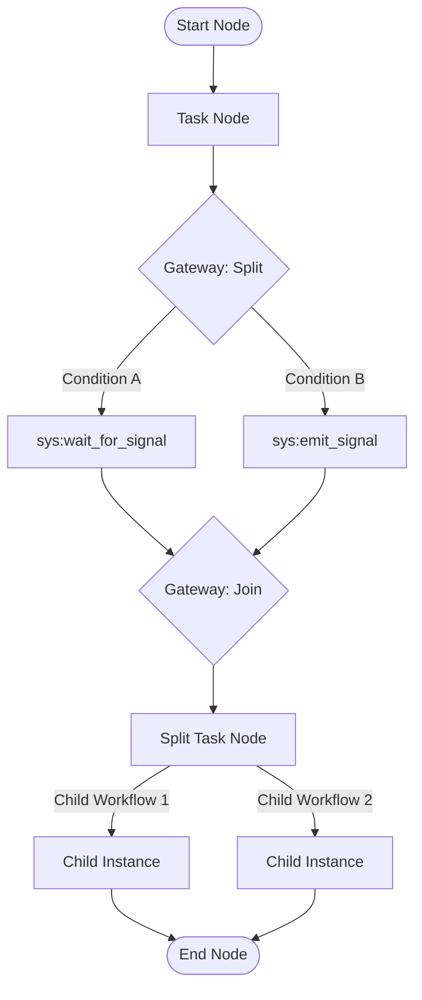

# Go Temporal Workflow Graph Interpreter Engine

A powerful, JSON-DSL-driven graph interpreter engine built on top of the Go [Temporal SDK](https://go.temporal.io/sdk). This engine dynamically executes complex directed-acyclic-graph (DAG) workflows defined in a JSON specification without requiring code redeployment.

## Key Features

- **DSL-Driven DAG Execution**: Runs workflows represented by structured nodes and conditional edges.
- **Multiple Node Types**:
  - **`START` / `END`**: Standard execution entry and exit points.
  - **`TASK`**: Executes application activities. Supports synchronous/asynchronous work execution, and specialized system tasks (`sys:emit_signal`, `sys:wait_for_signal`).
  - **`GATEWAY`**: Controls logical branching and joining (`EXCLUSIVE_SPLIT`, `PARALLEL_SPLIT`, `EXCLUSIVE_JOIN`, `PARALLEL_JOIN`).
  - **`SPLIT_TASK`**: Spawns multiple parallel child workflows dynamically (dynamic fan-out). Supports:
    - `SAME_TEMPLATE`: Homogeneous splits running the same template across payloads.
    - `DIFFERENT_TEMPLATES`: Poly-workflow / heterogeneous splits running different templates dynamically.
    - Failure handling configurations (`FAIL_FAST` or `COLLECT_ALL`).
- **Flexible Data Mapping**: Automatically maps keys between the global `WorkflowVariables` dictionary and task input/output scopes using `InputMapping` and `OutputMapping`.
- **Query & Signal Support**: Provides real-time queries for workflow execution state snapshots (`WorkflowInstance`) and processes external update events asynchronously.

---

## Architecture Overview



---

## DSL Specification (`dsl.go`)

Workflows are defined through the [WorkflowDefinition](https://github.com/OpenNSW/go-temporal-workflow/blob/main/dsl.go) structure.

### Node Config Definition
```go
type Node struct {
	ID             string            `json:"id"`
	Type           NodeType          `json:"type"`                       // START, END, TASK, GATEWAY, or SPLIT_TASK
	GatewayType    GatewayType       `json:"gateway_type,omitempty"`     // EXCLUSIVE_SPLIT, PARALLEL_SPLIT, etc.
	TaskTemplateID string            `json:"task_template_id,omitempty"` // ID of the task template to run
	InputMapping   map[string]string `json:"input_mapping,omitempty"`    // Maps WorkflowVariables -> Task Input Key
	OutputMapping  map[string]string `json:"output_mapping,omitempty"`   // Maps Task Output -> WorkflowVariables Key
	SplitTask      *SplitTaskConfig  `json:"split_task,omitempty"`       // Configuration for dynamic fan-out splits
}
```

### Dynamic Fan-out Configuration (`SplitTaskConfig`)
```go
type SplitTaskConfig struct {
	Mode            SplitMode   `json:"mode"`                       // SAME_TEMPLATE or DIFFERENT_TEMPLATES
	ItemsVariable   string      `json:"items_variable"`             // Global variables dot-path pointing to []map[string]any
	ResultsVariable string      `json:"results_variable,omitempty"` // Destination variable to save aggregated sub-workflow outputs
	FailureMode     FailureMode `json:"failure_mode"`               // FAIL_FAST or COLLECT_ALL
	IterationKey    string      `json:"iteration_key,omitempty"`    // Sub-context namespace key (defaults to "_iter")
}
```

---

## System Task Templates

`sys:emit_signal` and `sys:wait_for_signal` let sibling branches spawned by the *same*
`SPLIT_TASK` node coordinate with each other. The relay is **one hop up, one hop back down** —
a child signals its immediate parent, and the parent rebroadcasts only to the other children it
spawned for that same `SPLIT_TASK` node. It does not bubble further up an ancestor chain, and it
does not cascade down into a sibling's own nested sub-splits. If you need coordination across
more than one level of nesting, each level must explicitly re-emit the signal itself — there is
no built-in multi-level relay.

### 1. `sys:emit_signal`
Emits an asynchronous signal from a child workflow to its sibling branches (those spawned by the
same `SPLIT_TASK` node), brokered through the parent.
* **Requirements**: Must provide the `signal_name` and `payload` via `InputMapping`.
* **Execution**: Passes messages through the parent broker using a `child_broadcast_signal:<split_node_id>` channel, scoped to the SPLIT_TASK node that spawned this branch so concurrent split tasks in the same workflow don't cross-deliver broadcasts. Safe for standalone execution (gracefully ignores signaling if no parent workflow ID is registered).

### 2. `sys:wait_for_signal`
Blocks workflow execution until a signal matching the specified channel name is received from a
sibling branch via the parent broker (see above for the one-hop scope).
* **Requirements**: Must map the target `signal_name` in `InputMapping`.
* **Execution**: Dynamically subscribes to the named channel on Temporal and processes the payload back into the workflow variables dictionary using its `OutputMapping`.

---

## Integration Setup

To run the engine inside a Go application, initialize the `TemporalManager` with your task and completion handlers:

```go
import "github.com/OpenNSW/go-temporal-workflow"

// Initialize the TemporalManager (this automatically registers the workflow and activities internally)
manager := engine.NewTemporalManager(
    temporalClient,
    "your-task-queue",
    taskHandler,       // TaskActivationHandler
    completionHandler, // WorkflowCompletionHandler
)

// Register sub-workflow definition loader (required if using SPLIT_TASK nodes)
manager.RegisterDefinitionHandler(func(templateID string) (engine.WorkflowDefinition, error) {
    // Retrieve definition from database or local files
    return loadDefinition(templateID), nil
})

// Start the internal worker to begin execution
err := manager.StartWorker()
if err != nil {
    log.Fatalf("Failed to start worker: %v", err)
}
```

## Running Tests

Run the integration suite locally to verify engine features:
```bash
go test -race -v ./...
```
