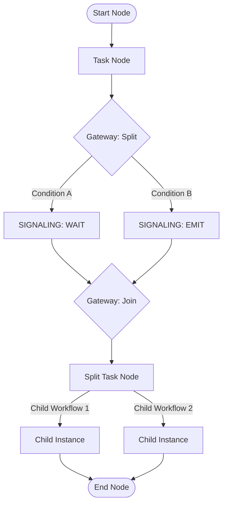

# Go Temporal Workflow Graph Interpreter Engine

A powerful, JSON-DSL-driven graph interpreter engine built on top of the Go [Temporal SDK](https://go.temporal.io/sdk). This engine dynamically executes complex directed-acyclic-graph (DAG) workflows defined in a JSON specification without requiring code redeployment.

## Key Features

- **DSL-Driven DAG Execution**: Runs workflows represented by structured nodes and conditional edges.
- **Multiple Node Types**:
  - **`START` / `END`**: Standard execution entry and exit points.
  - **`TASK`**: Executes application activities. Supports synchronous/asynchronous work execution.
  - **`GATEWAY`**: Controls logical branching and joining:
    - Control flow: `EXCLUSIVE_SPLIT`, `PARALLEL_SPLIT`, `EXCLUSIVE_JOIN`, `PARALLEL_JOIN`
    - Batch partitioning: `BATCH_SPLIT` (partitions item slices by evaluating edge conditions per-item and spawns composable child workflows), `BATCH_JOIN` (merges child results by item ID)
  - **`SPLIT_TASK`**: Spawns multiple parallel child workflows dynamically (dynamic fan-out). Supports:
    - `SAME_TEMPLATE`: Homogeneous splits running the same template across payloads.
    - `DIFFERENT_TEMPLATES`: Poly-workflow / heterogeneous splits running different templates dynamically.
    - Failure handling configurations (`FAIL_FAST` or `COLLECT_ALL`).
  - **`SIGNALING`**: Coordinates sibling branches spawned by the same `SPLIT_TASK` node without invoking any external activity. Two sub-types:
    - `EMIT`: Fires a signal asynchronously to all sibling branches (one hop up to the parent, one hop back down).
    - `WAIT`: Blocks the branch until a named signal is received from a sibling.
- **Flexible Data Mapping**: Automatically maps keys between the global `WorkflowVariables` dictionary and task input/output scopes using `InputMapping` and `OutputMapping`.
- **Query & Signal Support**: Provides real-time queries for workflow execution state snapshots (`WorkflowInstance`) and processes external update events asynchronously.

---

## Architecture Overview


```mermaid
graph TD
    Start([Start Node]) --> Task1[Task Node]
    Task1 --> Gate1{Gateway: Split}
    Gate1 -->|Condition A| SigWait[SIGNALING: WAIT]
    Gate1 -->|Condition B| SigEmit[SIGNALING: EMIT]
    SigWait --> Gate2{Gateway: Join}
    SigEmit --> Gate2
    Gate2 --> Split1[Split Task Node]
    Split1 -->|Child Workflow 1| Child1[Child Instance]
    Split1 -->|Child Workflow 2| Child2[Child Instance]
    Child1 --> End([End Node])
    Child2 --> End
```

---

## DSL Specification (`dsl.go`)

Workflows are defined through the [WorkflowDefinition](https://github.com/OpenNSW/go-temporal-workflow/blob/main/dsl.go) structure.

### Node Config Definition
```go
type Node struct {
	ID             string            `json:"id"`
	Type           NodeType          `json:"type"`                       // START, END, TASK, GATEWAY, SPLIT_TASK, TIMER, or SIGNALING
	GatewayType    GatewayType       `json:"gateway_type,omitempty"`     // EXCLUSIVE_SPLIT, PARALLEL_SPLIT, BATCH_SPLIT, BATCH_JOIN, etc.
	TaskTemplateID string            `json:"task_template_id,omitempty"` // ID of the task template to run
	InputMapping   map[string]string `json:"input_mapping,omitempty"`    // Maps WorkflowVariables -> Task Input Key
	OutputMapping  map[string]string `json:"output_mapping,omitempty"`   // Maps Task Output -> WorkflowVariables Key
	SplitTask      *SplitTaskConfig  `json:"split_task,omitempty"`       // Configuration for dynamic fan-out splits
	Timer          *TimerConfig      `json:"timer,omitempty"`            // Configuration for durable timer waits
	Signaling      *SignalingConfig  `json:"signaling,omitempty"`        // Configuration for EMIT/WAIT signaling
	BatchGateway   *BatchGatewayConfig `json:"batch_gateway,omitempty"`  // Configuration for BATCH_SPLIT item partitioning
	BatchJoin      *BatchJoinConfig    `json:"batch_join,omitempty"`     // Configuration for BATCH_JOIN item merging
}
```

### Batch Gateway Configuration (`BatchGatewayConfig` & `BatchJoinConfig`)
```go
type BatchGatewayConfig struct {
	ItemsVariable string `json:"items_variable,omitempty"` // Dot-path to []Item (defaults to "_items")
	IDField       string `json:"id_field,omitempty"`       // Unique item identifier field (defaults to "id")
}

type BatchJoinConfig struct {
	GatewayNodeID string `json:"gateway_node_id"`          // Node ID of paired BATCH_SPLIT
	ItemsVariable string `json:"items_variable,omitempty"` // Dot-path to []Item (defaults to "_items")
	IDField       string `json:"id_field,omitempty"`       // Unique item identifier field (defaults to "id")
}
```

### Dynamic Fan-out Configuration (`SplitTaskConfig`)
```go
type SplitTaskConfig struct {
	Mode            SplitMode   `json:"mode"`                       // SAME_TEMPLATE or DIFFERENT_TEMPLATES
	ItemsVariable   string      `json:"items_variable"`             // Global variables dot-path pointing to []map[string]any
	ResultsVariable string      `json:"results_variable,omitempty"` // Destination variable to save aggregated sub-workflow outputs
	FailureMode     FailureMode `json:"failure_mode"`               // FAIL_FAST or COLLECT_ALL
	IterationKey    string      `json:"iteration_key,omitempty"`    // Sub-context namespace key (defaults to "_iter")
}
```

---

## Signaling Nodes

`SIGNALING` nodes with sub-type `EMIT` or `WAIT` let sibling branches spawned by the *same*
`SPLIT_TASK` node coordinate with each other. The relay is **one hop up, one hop back down** —
a child signals its immediate parent, and the parent rebroadcasts only to the other children it
spawned for that same `SPLIT_TASK` node. It does not bubble further up an ancestor chain, and it
does not cascade down into a sibling's own nested sub-splits. If you need coordination across
more than one level of nesting, each level must explicitly re-emit the signal itself — there is
no built-in multi-level relay.

### `EMIT` sub-type
Broadcasts a signal from a child workflow to **all** sibling branches (every other child spawned
by the same `SPLIT_TASK` node), brokered through the parent. Every sibling receives its own copy
— there is no targeting a single branch.
* **Config fields**: `signal_name` (required), `payload` (optional `map[string]any`).
* **Execution**: Passes messages through the parent broker using a `child_broadcast_signal:<split_node_id>` channel, scoped to the SPLIT_TASK node that spawned this branch so concurrent split tasks in the same workflow don't cross-deliver broadcasts. Safe for standalone execution (gracefully warns if no parent workflow ID is registered).

```json
{ "id": "emit_ready", "type": "SIGNALING", "signaling": { "type": "EMIT", "signal_name": "branch_ready", "payload": { "status": "ok" } } }
```

### `WAIT` sub-type
Blocks workflow execution until **one** signal matching the specified channel name is received.
Because `EMIT` broadcasts to every sibling, a branch with N−1 siblings will have N−1 signals
queued after all siblings emit — one `WAIT` node consumes exactly one of them. Chain N−1
consecutive `WAIT` nodes to collect all of them (see the barrier pattern below).
* **Config fields**: `signal_name` (required).
* **Output**: Received payload is written into `WorkflowVariables` using the node's standard `output_mapping`.

```json
{ "id": "wait_ready", "type": "SIGNALING", "signaling": { "type": "WAIT", "signal_name": "branch_ready" }, "output_mapping": { "status": "branch.status" } }
```


### Signaling in `SAME_TEMPLATE` splits

When all branches run the same template, every branch has the same `EMIT` and `WAIT` nodes.
Two patterns arise — one works cleanly, one deadlocks.

**Barrier / rendezvous (✓ works)** — each branch emits when it completes a phase, then
collects one signal per sibling before proceeding. Since `EMIT` broadcasts to *all* siblings
and Temporal queues the incoming signals, a sequence of `N−1` consecutive `WAIT` nodes drains
them one at a time:

```
Phase 1 → EMIT("checkpoint") → WAIT("checkpoint") → WAIT("checkpoint") → Phase 2
                                  ↑ signal from B        ↑ signal from C
```

Constraint: the number of `WAIT` nodes must be hardcoded to exactly `N−1`, so this pattern
only works when the branch count is fixed and known at design time.

**Deadlock (✗ avoid)** — placing `WAIT` *before* `EMIT` on the same path means every branch
blocks simultaneously and no branch ever reaches `EMIT`:

```
WAIT("checkpoint") → ... → EMIT("checkpoint")   ← every branch hangs here, forever
```

**Recommended approach for producer/consumer coordination** — use `DIFFERENT_TEMPLATES` so
the asymmetry is explicit: one template contains only `EMIT`, the other contains only `WAIT`.
There is no risk of accidental deadlock and the intent is clear from the DSL alone.

---

## Integration Setup

To run the engine inside a Go application, initialize the `TemporalManager` with your task and completion handlers:

```go
import "github.com/OpenNSW/go-temporal-workflow"

// Initialize the TemporalManager (this automatically registers the workflow and activities internally)
manager := engine.NewTemporalManager(
    temporalClient,
    "your-task-queue",
    taskHandler,       // TaskActivationHandler
    completionHandler, // WorkflowCompletionHandler
)

// Register sub-workflow definition loader (required if using SPLIT_TASK nodes)
manager.RegisterDefinitionHandler(func(templateID string) (engine.WorkflowDefinition, error) {
    // Retrieve definition from database or local files
    return loadDefinition(templateID), nil
})

// Start the internal worker to begin execution
err := manager.StartWorker()
if err != nil {
    log.Fatalf("Failed to start worker: %v", err)
}
```

## Running Tests

Run the integration suite locally to verify engine features:
```bash
go test -race -v ./...
```
